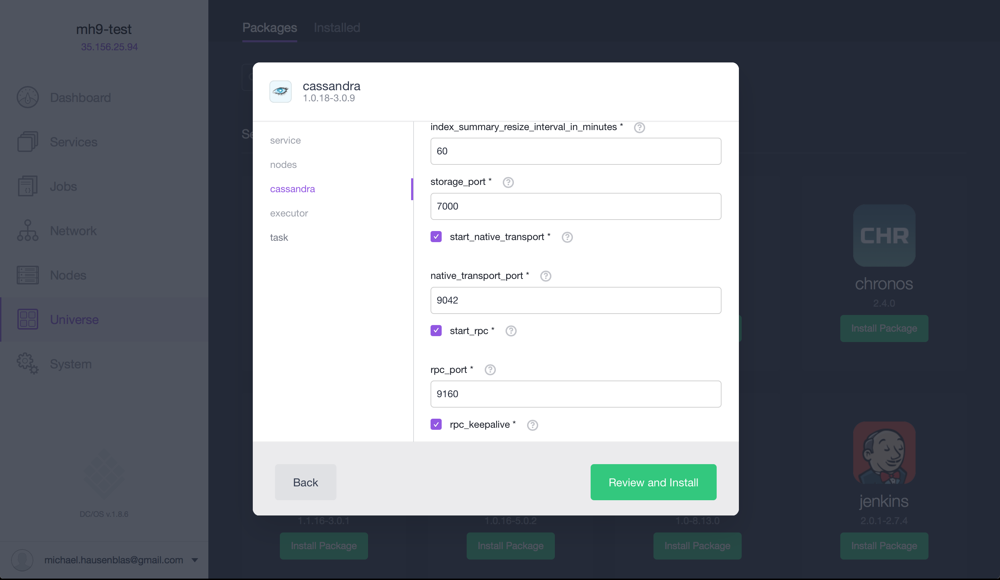

# GitHub stream data demo with KairosDB

In this tutorial you'll learn how to set up the time series database [KairosDB](http://kairosdb.github.io/)
along with the popular NoSQL database [Cassandra](http://cassandra.apache.org/) on [DC/OS](https://dcos.io).
We will use the [GitHub API](https://developer.github.com/v3/) as a stream datasource and build a dashboard
using [Grafana](http://grafana.org/).

The overall application architecture looks as follows: 


Note that above exemplary IP addresses and ports are shown, which varies based on the actual deployment.

This demo assumes you have a [DC/OS 1.8](https://dcos.io) cluster with at least 3 private nodes and 1 public node (the latter for the end-user facing components) up and running as well as the [DC/OS CLI](https://dcos.io/docs/1.8/usage/cli/install/) installed.

## Install Cassandra

First, we need to install [Cassandra](https://docs.mesosphere.com/manage-service/cassandra/) from the public Universe with the RPC enabled (note the checked `start_rpc` option):



Or, alternatively, you can install Cassandra via the DC/OS CLI:

    $ dcos package install --options=copt.json cassandra

With the following content for `copt.json`:

```json
{
  "cassandra": {
    "start_rpc": true,
    "rpc_port": 9160,
    "rpc_keepalive": true
  }
}
```

Note that it takes a couple of minutes until Cassandra is marked as healthy in the DC/OS dashboard; the Cassandra nodes are available via `$DCOS_DASHBOARD/service/cassandra/v1/nodes/connect`.

## Launch KairosDB 

KairosDB is a time series database that runs on top of Cassandra, offering a HTTP data API as well as a Web UI, both exposed via port `8080`.
Use the DC/OS CLI to launch the [KairosDB](kairosdb.json): 

    $ dcos marathon app add https://raw.githubusercontent.com/mesosphere/cassandra-kairosdb-tutorial/master/kairosdb.json

Once you see KairosDB running as a service, you can access its Web UI by looking up the [IP address of the public agent](https://dcos.io/docs/1.8/administration/locate-public-agent/) (`35.156.43.3` in my case) along with the port that DC/OS has assigned to the container:

    $ dcos marathon task list
    APP         HEALTHY          STARTED              HOST    ID
    /cassandra    True   2016-11-13T05:49:27.871Z  10.0.0.68  cassandra.ed41b93d-a964-11e6-83aa-9ac7779d790a
    /kairos       True   2016-11-13T06:04:13.650Z  10.0.7.32  kairos.00021191-a967-11e6-83aa-9ac7779d790a
    $ dcos marathon task show kairos.00021191-a967-11e6-83aa-9ac7779d790a
    {
      "appId": "/kairos",
      "host": "10.0.4.20",
      "id": "kairos.ce522993-c9b6-11e5-bf2e-02181a13a4a7",
      "ipAddresses": [
        {
          "ipAddress": "172.17.0.2",
          "protocol": "IPv4"
        }
      ],
      "ports": [
        24653,
        24654,
        24655,
        24656
      ],
    ...

The first port (in out example this is `24653`) is mapped to container port `8080` and if you combine that with the IP address of the public agent you can now access the KairosDB Web UI:


Even now, without any data ingested from GitHub, you can toy around with the internal metrics available. Also, if you're interested in the internals of KairosDB on DC/OS, check out the [manual launch notes](manual-launch.md).

## Launch Grafana

We want to build a dashboard with Grafana, plotting the time series data from KairosDB. For that we need to first launch [Grafana](grafana.json):

    $ dcos marathon app add grafana.json
    
Note that you can look up Grafana's serving port on the public agent in the same fashion as described above for KairosDB.

Next step is to connect Grafana to KairosDB as a backend, which is supported since [v2.1](http://docs.grafana.org/v2.6/datasources/kairosdb/).
Start by visiting the Grafana Web UI and authenticating with `user:**admin**` and `password:**admin**`. Next, add a new data source as shown below:


Once you've completed this step you're almost good to go.

## Get data from GitHub

In this demo we use GitHub activity as the data source. To ingest data from GitHub into KairosDB, a custom Docker image is used, called the [GitHub Fetcher](github-fetcher/). In a nutshell, it polls `https://api.github.com/orgs/$ORG/events` with a configurable time interval and uses the KairosDB HTTP API to ingest the datapoints. 

We launch the [GitHub fetcher](fetcher.json) with a customized value for `KAIROSDB_API` value in `fetcher.json`. The value must point to the IP/port that we found earlier for the KairosDB Web UI. The provided endpoint must *not* end in a slash:

    ...
    "env": {
        "KAIROSDB_API": "http://52.11.127.207:24653",
        "GITHUB_ORG": "mesosphere",
        "POLL_INTERVAL": "60"
    },
    ...

Note:

- You can customize the Github organization by editing `GITHUB_ORG`.
- The period between refreshes can be customized by changing `POLL_INTERVAL` with a default value of 60 sec.

And now you're ready to launch the GitHub fetcher:

    $ dcos marathon app add github-fetcher.json

## Usage

Once you've gone through the preparation steps and launched both KairosDB and Grafana as well as configured the GitHub fetcher as discussed in the previous section, you're ready to start importing and visualizing Github statistics.

As data is ingested from the GitHub API into Cassandra and available in Grafana you can either create your own dashboards or import the one [we've prepared](dashboard.json) and take it from there:


The result of the import is the GitHub activity of an organization:


Note that you can play around with the tags to show a drilldown in terms of activities (such as pull requests, comments, etc.) and actors (GitHub users).